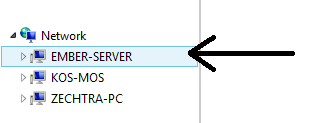
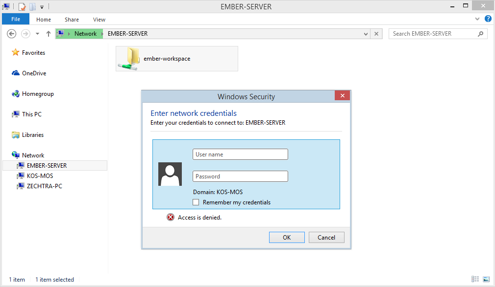

# Ember CLI Development in Windows

I like Windows. I have been using it since XP days (_let us forget that Vista ever happened_). I'm also a software developer, and as much I hate saying this, developing in Windows can suck.

I have recently started getting into `ember.js` using `ember-cli`. I loved how easy it is to get started with it and being able to create new parts of your project by simply typing something like `ember generate controller foo`. But in Windows, the experience is a bit different...

## Initial experience
Install `ember-cli`

    npm install -g ember-cli

Create an application

    ember new awesomesauce

Add a route

    ember generate route gravy

Done, done and done!

Let's start the server

    ember serve

```
version: 0.1.12
Livereload server on port 35729
Serving on http://0.0.0.0:4200/

Build successful - 1719ms.

Slowest Trees                  | Total
-------------------------------+----------------
TreeMerger (ExternalTree)      | 393ms
TreeMerger (appAndDependencies) | 166ms
TreeMerger (stylesAndVendor)   | 130ms
Concat: Vendor                 | 108ms
CustomStaticCompiler           | 92ms
```

That was fast!

This sets up a LiveReload server that is listening for our changes to the code, and if there's a change, the browser automatically refreshes the page. This tightens the development loop.

So if we edit our route template, we should see output on the terminal

```
file changed templates\gravy.hbs

Build successful - 3273ms.

Slowest Trees                  | Total
-------------------------------+----------------
TreeMerger (stylesAndVendor)   | 585ms
TreeMerger (appAndDependencies) | 437ms
Concat: Vendor                 | 345ms
CustomStaticCompiler           | 339ms
TreeMerger (ExternalTree)      | 254ms
```

That's cool right? But as you can see it takes a whole **3 seconds** before you
actually see the change on your browser. This isn't a very fast and it gets worse
the more changes you make to your project.

## More speed, or lack thereof

The `ember-cli` developers are awesome but the speed problem is an issue with the way symbolic links are handled in Windows, you can read more about it in this GitHub [issue](https://github.com/ember-cli/ember-cli/issues/1558).

There are [a](http://www.ember-cli.com/#disable-windows-search-index-for-temporary-files) [few](http://www.ember-cli.com/#disable-windows-defender-for-temporary-files) [solutions](http://www.ember-cli.com/#symlinks-on-windows) recommended on the `ember-cli` documentation. I tried all them, but I still suffered from slow compile times.

I thought it was over, I didn't have the patience to wait 3 seconds everytime I made a change. Sure it may not be a long time, but I had a similar setup in a different project using `gulp.js` and the wait was close to none. I just couldn't do it.

I didn't want to use Linux either, not because I'm afraid of it but because WebStorm looks like poop in Linux. Petty reason, but important to me.

## Virtual machines

Even though I said I didn't want to use Linux, I did so anyway. I set up an Ubuntu VM on VirtualBox. Installed all of the stuff necessary to get going and it was way way faster.

But it just looked too ugly.

I was at a bind, `ember` compiles flawlessly in Linux but the IDE looks horrendous, but it looks just fine in Windows but the compilation process is a pain. I needed a hybrid solution.

## Vagrant and Samba

The solution was to use Vagrant to spawn a Linux VM that is running a Samba service that exposes a network folder that both the Windows host and Linux guest can access.

The Vagrant VM will compile the changes that are made to the `ember-cli` project and I can edit the code on my favourite IDE!

_Brilliant!_

### Vagrantfile

To get this setup working, you'll need to have [Vagrant](https://docs.vagrantup.com/v2/installation/) and [VirtualBox](https://www.virtualbox.org/wiki/Downloads) installed. Here's the `Vagrantfile` I'm using:

```
VAGRANTFILE_API_VERSION = "2"

Vagrant.configure(VAGRANTFILE_API_VERSION) do |config|
  config.vm.box = "ubuntu/trusty64"

  # Ember default port
  config.vm.network "forwarded_port", guest: 4200, host: 4200

  # LiveReload default port
  config.vm.network "forwarded_port", guest: 35729, host: 35729

  config.vm.hostname = "ember-server"
  config.vm.network "public_network", ip: "192.168.0.160"
end
```

This will tell Vagrant create an Ubuntu 14.04 VM and give it a static IP. In addition, this also tells VirtualBox to forward two ports from the guest to the host. So ports 4200 and 35729 will be accessible via http://localhost:4200 and http://localhost:35729.

Run `vagrant up` and this will set up your VM and you're ready to start installing dependencies.

### Install dependencies

By this point, your VM should already be running and you should be able to ssh into it by running `vagrant ssh`. Once you're in, you need to run the following commands as `sudo` to install the dependencies needed:

```sh
# Add git ppa repository
add-apt-repository ppa:git-core/ppa

# Install Ubuntu build dependencies
curl -sL https://deb.nodesource.com/setup | bash -
apt-get install -y nodejs git build-essential automake

# Install Samba
apt-get install -y samba samba-common python-glade2 system-config-samba

# Install ember-cli and bower
npm install -g ember-cli bower
```
This will install all the dependencies needed to be able to compile `ember` projects
and to be able to start `samba`.

### Configure Samba

This section is a bit more involved as we have to edit a configuration file and run some crazy commands, but let's get started. So first of all you'll need to edit `/etc/samba/smb.conf` to have the following contents:

```
[global]
workgroup = WORKGROUP
server string = Samba Server %v
security = user
map to guest = bad user
name resolve order = bcast host
dns proxy = no

[ember-workspace]
path = /samba/ember-workspace
browsable = yes
writable = yes
guest ok = no
read only = no
```

This is going to be the Samba configuration that we need to access the files from Windows. If your `WORKGROUP` is different, make sure to edit it otherwise leave as-is.

Next we need to create the folder that we want to share and give it the proper permissions. Run these commands using `sudo`:

```sh
share=/samba/ember-workspace
mkdir -p $share
chmod -R 0755 $share
chown -R vagrant:vagrant $share
```

Next we need to give our samba user,`vagrant`, a password:

    sudo smbpasswd -a vagrant

Finally, we must restart the samba service:

    sudo service smbd restart

DONE!

_Optional: You may want to create a symlink to the `ember-workspace` into your vagrant home_

    ln -s /samba/ember-workspace /home/vagrant/ember-workspace

### Configure Windows

We're almost there, all we need to do now is authenticate against our Samba server. Open a new `explorer.exe` window and the network location. If you followed the defaults it'l be named `EMBER-SERVER`.



Double-clicking on the network location will reveal the share, `ember-workspace`. Trying to open that will bring up a login prompt, in which you'll type in the user `vagrant` and whatever password you chose when running the `smbpasswd` command.



Once you authenticate, you can choose to mount the drive and use it as if it on your local drive.

## Results

Running the same application from my [initial experience](#initial-experience) resulted in this:

```sh
vagrant@ember-server:~/ember-workspace/awesomesauce$ ember serve
version: 0.1.12
Livereload server on port 35729
Serving on http://0.0.0.0:4200/

Build successful - 404ms.

Slowest Trees                  | Total
-------------------------------+----------------
Concat: Vendor                 | 114ms
SixToFive                      | 36ms
ES3SafeFilter                  | 30ms
ES6Modules                     | 29ms
JSHint app- QUnit              | 21ms

file changed templates/gravy.hbs

Build successful - 230ms.

Slowest Trees                  | Total
-------------------------------+----------------
Concat: Vendor                 | 79ms
SourcemapConcat                | 25ms
SourcemapConcat                | 15ms
```

I don't know about you, but this is very awesome! This is a very long process, so I'd recommend you fork my project in [Github](https://github.com/jvtrigueros/ember-vagrant) that's ready to go.

## Problems

As with anything I touch, nothing every works 100%. I'm having some issues with Webstorm being a bit slow on indexing and being able to realize that files have changed. If anyone has a solution for that I'd greatly appreciate a note or comment below.
